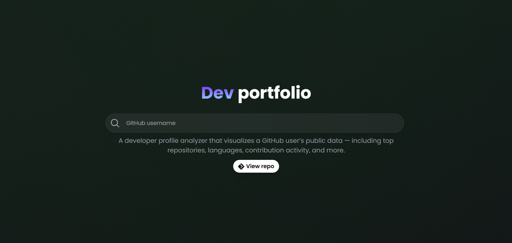

# **Octoviz**  
*A GitHub Developer Profile Analyzer*

 <!-- Replace with actual image path -->

Octoviz lets you explore and visualize a GitHub user's public profile data in a clean, interactive format. Just paste a GitHub profile URL to see insights like top repositories, most used languages, and recent contribution activity.

---

## ✨ Features

- 🔍 Analyze any public GitHub profile by URL  
- 📄 Displays user info:
  - GitHub avatar and bio
  - Top repositories (by star count)
  - Most used programming languages
  - Recent contribution stats  
- 📱 Fully responsive — works great on desktop and mobile  
- 🛠️ Built with:
  - **Frontend**: React  
  - **Backend**: Go (Gin framework)  

---

## 🚀 Getting Started

### 🧠 Prerequisites

- **Go** installed (for the backend)  
- **GitHub Personal Access Token**
  > Required for authenticating API requests and avoiding rate limits- **Node.js & npm** (for the frontend)  
- [Optional] **Air** for live-reloading in Go development

---

### Backend Setup

```bash
cd server

# If you have Air installed
air

# Or run directly
go run main.go
```

---

### Frontend Setup

```bash
cd frontend

### 📦 Install Dependencies
npm install

npm run dev
```